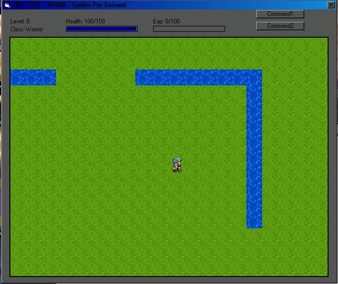



## Update \- RPG Engine \(DX\)

### Description

Update to my earlier game, has a few new features, i also changed it to use time based moedling, which allows the game to run the same speed on any computer without limiting the frame rate. After all, why should people with faster computers be punished? =)
 
### More Info
 

             |
---                |---
**Submitted On**   |2002-05-08 15:53:24
**By**             |[Matt P Claiborne](https://github.com/Planet-Source-Code/PSCIndex/blob/master/ByAuthor/matt-p-claiborne.md)
**Level**          |Intermediate
**User Rating**    |4.0 (16 globes from 4 users)
**Compatibility**  |VB 5\.0, VB 6\.0
**Category**       |[Graphics](https://github.com/Planet-Source-Code/PSCIndex/blob/master/ByCategory/graphics__1-46.md)
**World**          |[Visual Basic](https://github.com/Planet-Source-Code/PSCIndex/blob/master/ByWorld/visual-basic.md)
**Archive File**   |[Update\_\-\_R81405592002\.zip](https://github.com/Planet-Source-Code/matt-p-claiborne-update-rpg-engine-dx__1-34515/archive/master.zip)

